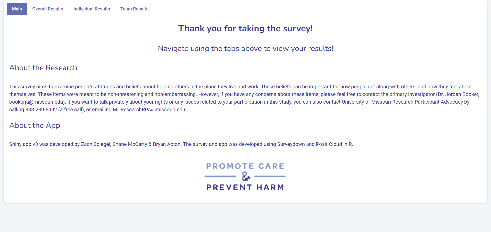

## Mindsets Results

### Purpose

In collaboration with Shane McCarty and Promote Care & Promote Harm, I created a new version of the "Mindsets to Promote Care & Prevent Harm" quiz. This project contains the results component.

More info about the organization can be found [here](https://promotecare.org/).

This version of the app is currently taking-in data and has not been published yet.

## Shiny Interface

## Project Files

-   app.R: Contains the code that renders app
-   \_brand.yml: Custom theming for app

## Authors & Citation

This R shiny app was developed in the Public Health stream of the First-Year Research Immersion (FRI) program at Binghamton University.

Conceptualization: Zach Spiegel, Shane McCarty

Data Curation: Zach Spiegel

Formal Analysis: Zach Spiegel

Funding: Shane McCarty, Binghamton FRI Program

Investigation: Zach Spiegel, Shane McCarty

Methodology: Zach Spiegel, Shane McCarty

Project Administration: Zach Spiegel

Software: Zach Spiegel

Resources: Shane McCarty

Supervision: Shane McCarty

Validation: Zach Spiegel

Visualization: Zach Spiegel

Writing: Zach Spiegel

Zach Spiegel and Shane McCarty, PhD
